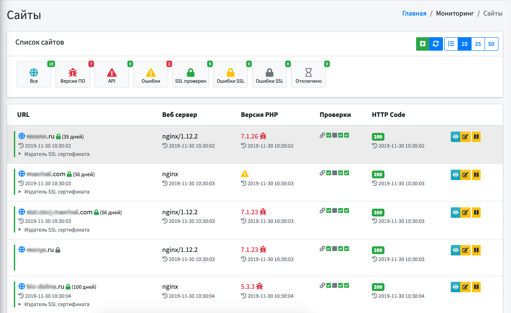

# MoRiNg (система мониторинга)


<p align="center">

</p>

MoRiNg - opensource система мониторинга. На данный момент реализованы следуюшие функции:
 - Мониторинг сайтов
    - проверка кода ответа сайта
    - проверка наличия SSL сертификата
    - проверка срока окончания действия SSL сертификата
    - проверка версии PHP интерпретатора
---
### Ветки
* Master [](https://github.styleci.io/repos/220468288/shield?branch=master)
    
    Используется для получения актуальной версии системы, либо для обновления уже используемых копий.
    
    ---
    
* Dev [](https://github.styleci.io/repos/220468288/shield?branch=dev)

    Временная ветка используемая разработчиками для сохранения изменений до официального релиза новой версии.
    
    :heavy_exclamation_mark: Не рекомендуется к использованию в production системах.
***
### Системные требования

* PHP 7.3
* composer
* Fileinfo PHP Extension
***
### Установка
* клонируйте репозиторий

  ```bash
  git clone https://github.com/TripleSD/moring.git
  ```
* внести изменения в ```.env``` файл
* запустите установку зависимостей
    ```bash
    composer install
    ``` 
* запустите генерацию приватного ключа 
    ```bash
    php artisan key:generate
    ```
* запустите миграции с установкой первоначальных данных
    ```bash
    php artisan migrate --seed
    ``` 
* войдите в систему используя логин `admin@localhost` и пароль `admin`
***
### Документация
Минимальная документация по использованию системой будет подготовлена и опубликована в ближайшее время.
***
### Техническая поддержка
Если у вас возникли трудности при использовании системы, Вы можете обратиться
к команде разработчиков для получения консультации по адресу ```support@moring.ru```
 
 Если Вы обнаружили неточность в работе системы, просьба открыть новое [обсуждение(issue)](https://github.com/TripleSD/moring/issues)
***
### Помощь проекту
Вы можете внести свой вклад в разработку системы.
Если Вы нашли ошибку в коде!
 * сделайте форк
 * внесите изменения
 * пришлите пулл реквест

Составление технической документации является такой же неотъемленной 
частью проекта как и код. 
***
### Авторы
 
 
***
### Используемые пакеты и фреймворки
* Фреймворк Laravel 6.5.0
* Тема AdminLTE
***
### Лицензия
MoRiNg является opensource проектом. Лицезируется на основе MIT License.
### Лог изменений по версиям
***

[Build.003](https://github.com/TripleSD/moring/releases/tag/build.003)
- **(Fix)** Исправлены столбцы назначения в скрипте получения сведений о новых версиях PHP
- **(Fix)** Исправлен порядок назначения default значений в скрипте проверки сайтов

[Build.002](https://github.com/TripleSD/moring/releases/tag/build.002)
- **(Fix)** Исправлены ошибки в таблице хранения новых версий
- **(Upd)** Добавлено минимальное описание проекта в README.md

[Build.001](https://github.com/TripleSD/moring/releases/tag/build.001)  
- **(New)** - Начало разработки основной системы на базе фреймворка Laravel 6.5.0
- **(New)** - Добавлена основная тема оформления системы
- **(New)** - Осуществлена настройка авторизации пользователей в системе без разделения прав
- **(New)** - Добавлено автоматическое получение сведений о бридже
- **(New)** - Добавлено автоматическое получение сведений о версиях системы
- **(New)** - Добавлено автоматическое получение сведений о новых версиях PHP интерпретатора
- **(New)** - Добавлен раздел мониторинга http/https сайтов
- **(New)** - Доработка темы оформления
- **(New)** - Добавлена проверка http кодов
- **(New)** - Добавлено получение версии web сервера
- **(New)** - Добавлена проверка версии php интерпретатора
- **(New)** - Добавлена проверка ssl сертификата
- **(New)** - Добавлена проверка сайта через moring файл
- **(New)** - Добавлена автоматическая проверка нового сайта при добавлении
- **(New)** - Добавлен быстрый опрос состояния всех сайтов
- **(New)** - Доработка карточки сайта (просмотр, редактирование, удаление)
