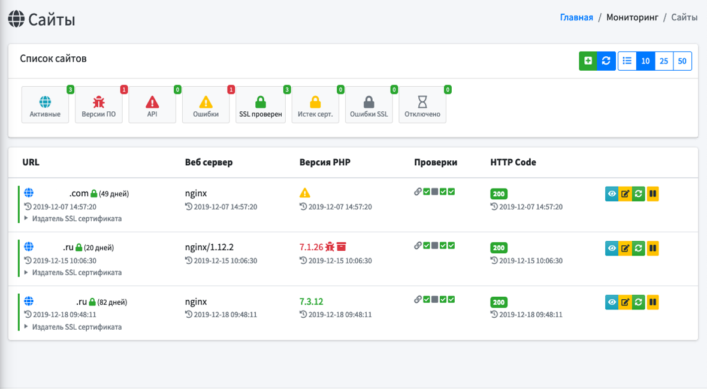

# MoRiNg (система мониторинга)

[]((https://img.shields.io/badge/Laravel-6.x-red?logo=laravel))
[]((https://img.shields.io/badge/PHP-7.x-blue?logo=php))


[](https://lgtm.com/projects/g/TripleSD/moring/alerts/)
[](https://lgtm.com/projects/g/TripleSD/moring/context:javascript)
<p align="center">


</p>

MoRiNg - opensource система мониторинга. На данный момент реализованы следуюшие функции:
 - Мониторинг сайтов
    - проверка кода ответа сайта
    - проверка наличия SSL сертификата
    - проверка срока окончания действия SSL сертификата
    - проверка версии PHP интерпретатора
    - проверка устройств по SNMP
    
 - - - 
 - [Ветки](#Ветки)
    - [Master](#Master)
    - [Dev](#Dev)
 - [Системные требования](#Системные-требования)
 - [Установка](#Установка)
 - [Обновление](#Обновление)
 - [Документация](#Документация)
 - [Техническая поддержка](#Техническая-поддержка)
 - [Помощь проекту](#Помощь-проекту)
 - [Авторы](#Авторы)
 - [Используемые пакеты и фреймворки](#Используемые-пакеты-и-фреймворки)
 - [Лицензия](#Лицензия)
 - [Лог изменений по версиям](#Лог-изменений-по-версиям)
- - - 

### Ветки
|Ветки|Описание|Статусы|
|---|---|---|
|Master|Используется для получения актуальной версии системы, либо для обновления уже используемых копий.|[](https://github.styleci.io/repos/220468288/shield?branch=master)
[](https://www.codacy.com/manual/AntonMZ/moring?utm_source=github.com&amp;utm_medium=referral&amp;utm_content=TripleSD/moring&amp;utm_campaign=Badge_Grade)|
|Dev|Временная ветка используемая разработчиками для сохранения изменений до официального релиза новой версии.|[](https://github.styleci.io/repos/220468288/shield?branch=dev)|
    
 :heavy_exclamation_mark: Не рекомендуется к использованию в production системах.
***
### Системные требования

* PHP 7.3
* composer
* Расширение fileinfo
* Расширение snmp
***
### Установка
* клонируйте репозиторий

  ```bash
  git clone https://github.com/TripleSD/moring.git
  ```
* скопируйте `.env.example` в `.env`
* запустите генерацию приватного ключа 
    ```bash
    php artisan key:generate
    ```
* внести изменения в ```.env``` файл
    ```bash
      APP_ENV=production
      APP_DEBUG=false
      DB_HOST=127.0.0.1
      DB_PORT=3306
      DB_DATABASE=laravel
      DB_USERNAME=root
      DB_PASSWORD=
      TIMEZONE="Europe/Moscow"
    ```
* запустите установку зависимостей
    ```bash
    composer install
    ``` 
* запустите миграции с установкой первоначальных данных
    ```bash
    php artisan migrate --seed
    ``` 
* добавьте крон задачу
    ```bash
    * * * * * cd /.../.../moring && php artisan schedule:run >> /dev/null 2>&1
    ```  
    :heavy_exclamation_mark: необходимо указывать фактический путь размещения папки moring
* смените права на папки
    ```bash  
      chmod 755 storage
      chmod 777 storage/framework/sessions/
      chmod 777 storage/framework/views/
      chmod 777 storage/logs/
      chmod 777 storage/framework/cache
    ```
* войдите в систему используя логин `admin@localhost` и пароль `admin`
***
### Обновление
* скачайте обновления
    ```bash
    git pull origin master
    ```
* запустите обновление зависимостей
    ```bash
    composer update
    ``` 
* запустите установку обновления таблиц базы данныз
    ```bash
    php artisan migrate
    ```  
***
### Документация
Минимальная документация по использованию системой будет подготовлена и опубликована в ближайшее время.
***
### Техническая поддержка
Если у вас возникли трудности при использовании системы, Вы можете обратиться
к команде разработчиков для получения консультации по адресу ```support@moring.ru```
 
 Если Вы обнаружили неточность в работе системы, просьба открыть новое [обсуждение(issue)](https://github.com/TripleSD/moring/issues)
***
### Помощь проекту
Вы можете внести свой вклад в разработку системы.
Если Вы нашли ошибку в коде!
 * сделайте форк
 * внесите изменения
 * пришлите пулл реквест

Составление технической документации является такой же неотъемленной 
частью проекта как и код. 
***
### Авторы
 
 
***
### Используемые пакеты и фреймворки
* Фреймворк Laravel 6.5.0
* Тема AdminLTE
***
### Лицензия
MoRiNg является opensource проектом. Лицезируется на основе MIT License.
***
### Лог изменений по версиям
Список изменений доступен в файле CHANGELOG.md
